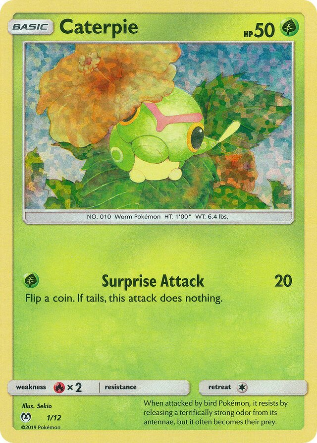
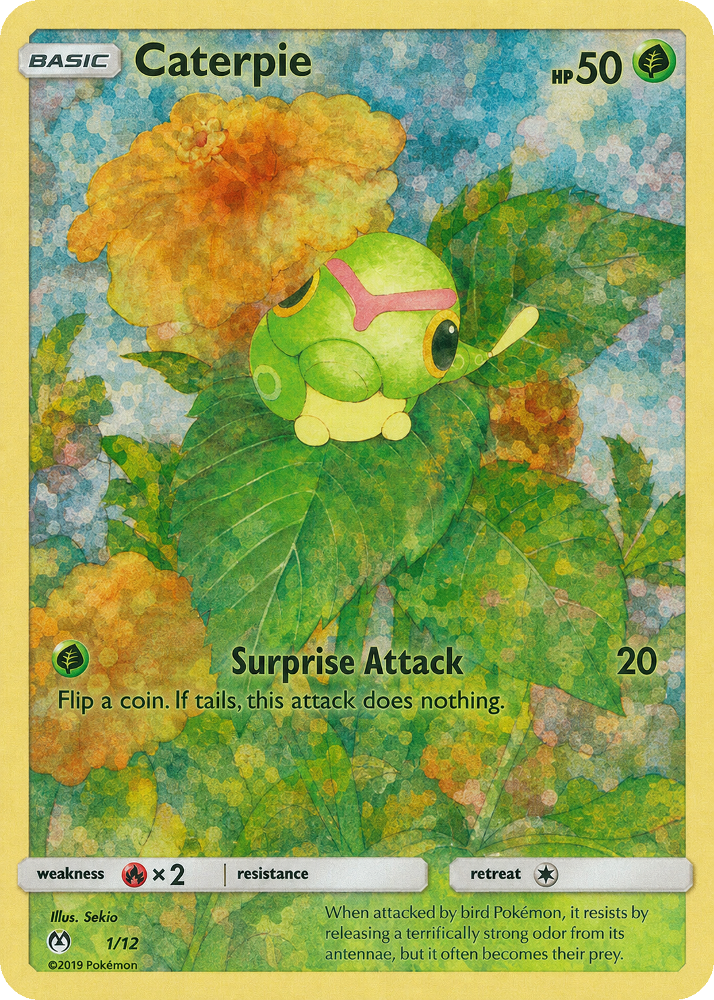
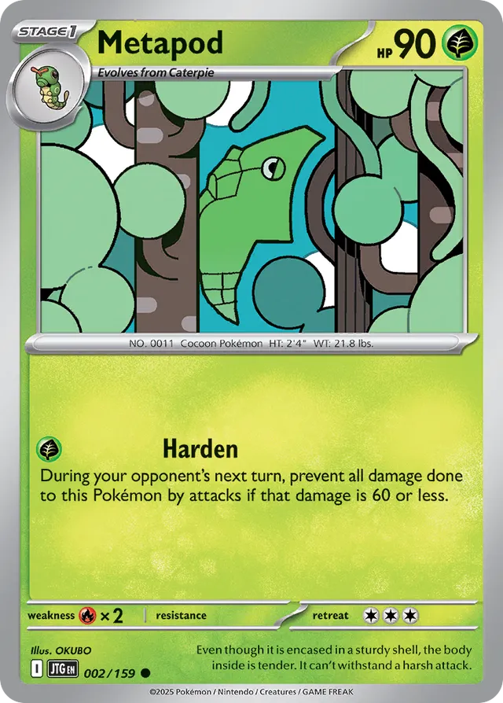
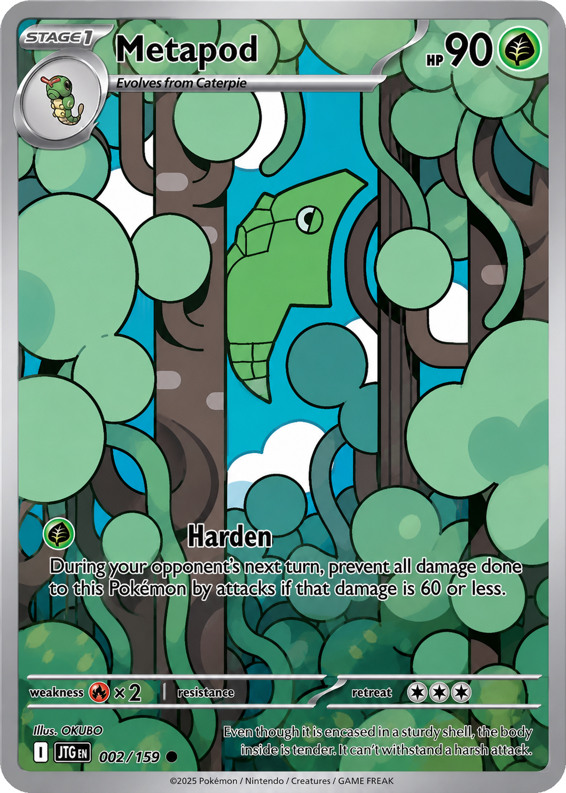
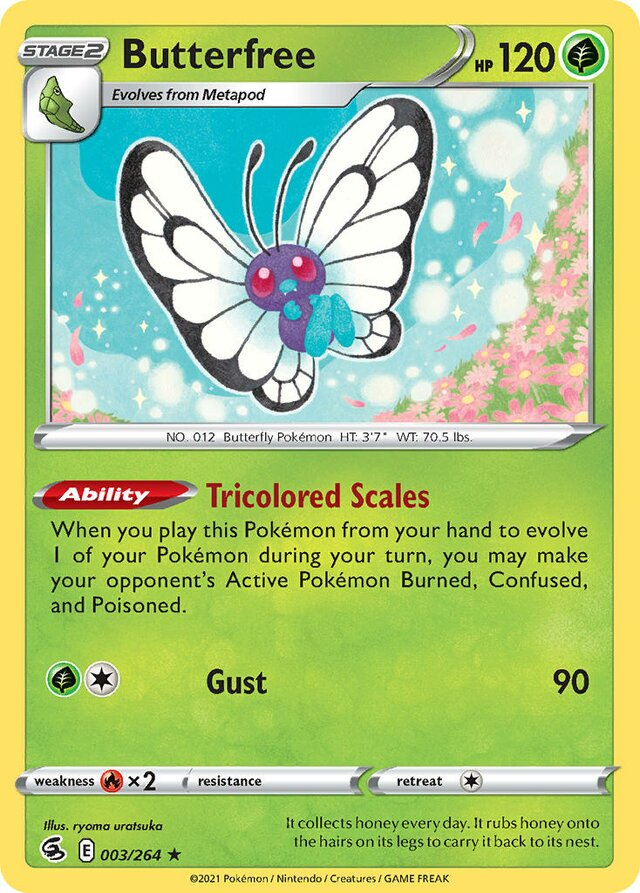
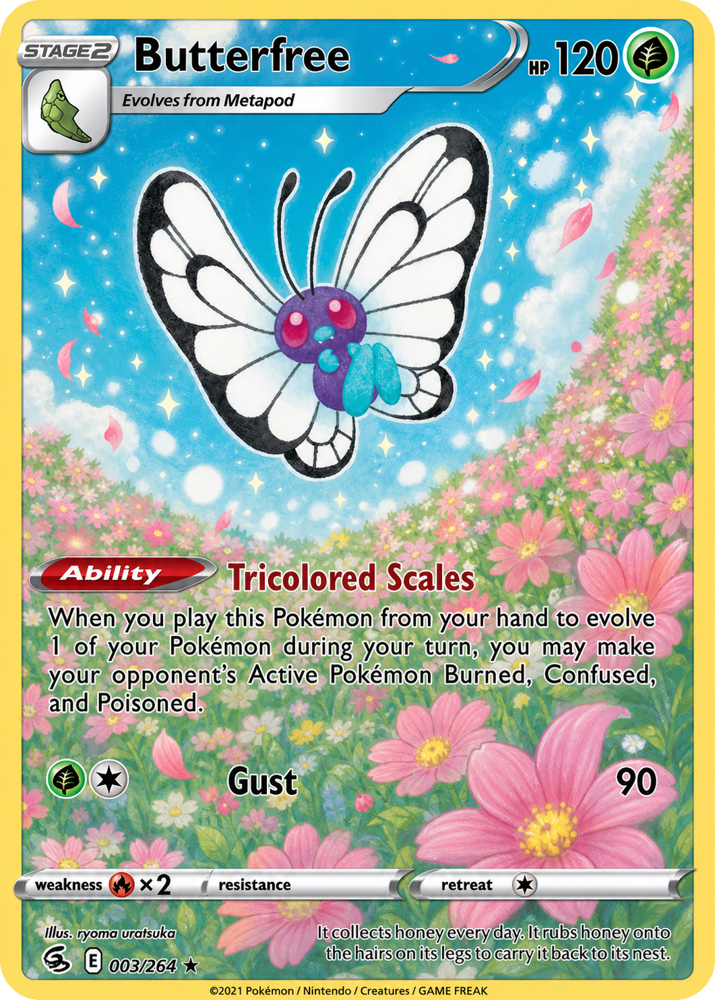

# Full Art Gen

A Codex skill for turning regular card-style illustrations into full-art card outpaints.

The skill keeps the card as a card: it preserves the outer rounded border, title/HP area, stage or evolution labels, attack/rules text, icons, weakness/resistance/retreat row, copyright line, and other UI overlays. It removes the horizontal middle information strip and extends the original illustration behind the top and lower card areas so the result reads as one continuous full-art scene.

## What It Does

- Converts one uploaded card image into one full-art outpainted card.
- Removes the narrow horizontal species/info strip around the lower edge of the illustration window.
- Extends the original illustration into the top name/HP area and lower rules area.
- Keeps non-target card UI and text readable in approximately the original positions.
- Preserves the outer rounded card border and transparent rounded corners.
- Returns the final PNG image and the final PNG's absolute file path.

## Examples

| Input | Full-art output |
| --- | --- |
|  |  |
|  |  |
|  |  |

## Installation

Copy the skill folder into your Codex skills directory:

```bash
mkdir -p ~/.codex/skills
cp -R skills/full-art-outpaint ~/.codex/skills/
```

Restart Codex or start a new task so the skill is discovered.

## Usage

Upload a card image and ask Codex to use the skill:

```text
Use $full-art-outpaint on this image.
```

The skill is intentionally one-image-in, one-image-out. It does not ask for style, size, character, target area, or composition details; the uploaded image is treated as the visual authority.

## Output

The final response shows:

- the final outpainted PNG image
- the final PNG's absolute file path

The accepted image is post-processed as RGBA PNG with transparent rounded corners. Only pixels outside the card's rounded rectangle should become transparent; the card border itself is preserved.

## Repository Structure

```text
.
├── examples/
│   ├── Butterfree.jpg
│   ├── butterfree_full_art_outpaint.png
│   ├── Caterpie.jpg
│   ├── caterpie_full_art_outpaint.png
│   ├── Metapod.webp
│   └── metapod_full_art_outpaint.png
└── skills/
    └── full-art-outpaint/
        ├── SKILL.md
        ├── agents/
        │   └── openai.yaml
        └── scripts/
            └── apply_rounded_alpha.py
```

## Notes

This repository contains a Codex skill, not a standalone image-generation app. The actual image edit is performed through Codex's image generation/editing capability, and `scripts/apply_rounded_alpha.py` handles the deterministic final rounded-corner alpha pass.

Example images are included to demonstrate the workflow and expected before/after behavior. This project is not affiliated with, endorsed by, or sponsored by any card game publisher or rights holder.
