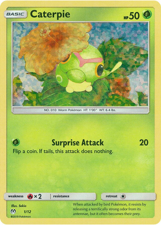
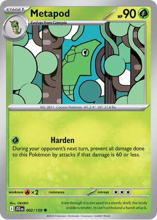
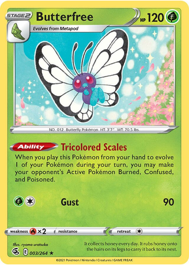
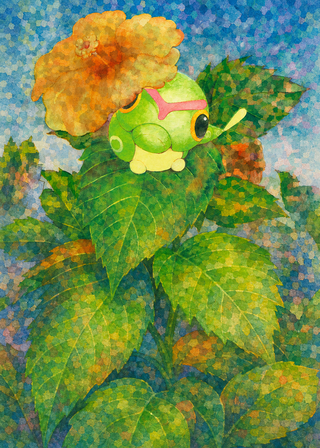
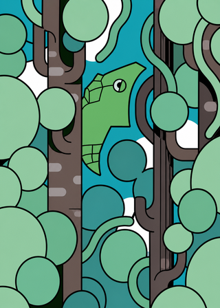
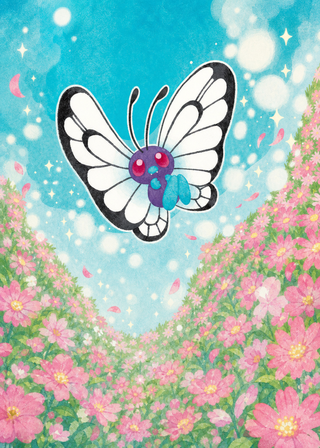
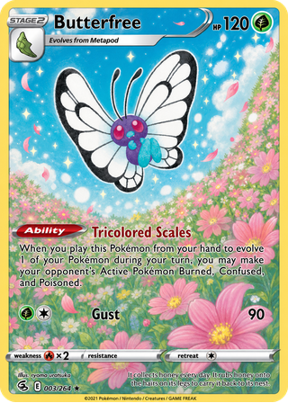

# Full Art Gen

Codex skills for turning regular card-style illustrations into full-art outpaints.

This repo now keeps two workflows:

- `full-art-image-only`: the main workflow. Generates one UI-free `art-only.png`.
- `full-art-image-with-ui`: the UI-preserving workflow. Generates one complete full-art card as `full-art-card.png`.

## Workflows

### Main: Art Only

Use `$full-art-image-only` when you want only the illustration.

- Converts one uploaded card image into one art-only full-card portrait.
- Removes all card UI, text, symbols, strips, panels, frame lines, logos, and the outer border/rim.
- Extends the original illustration across the full rectangular canvas.
- Saves an opaque RGB image named `art-only.png`.
- Outputs to `outputs/full-art-image-only/YYYYMMDD-HHMMSS/art-only.png`.
- Current installed version: `20260716-102916`.

### With UI: Full Card

Use `$full-art-image-with-ui` when you want a complete full-art card with UI retained.

- Converts one uploaded card image into one full-art card.
- Removes the horizontal middle species/info strip.
- Preserves the outer rounded border, title/HP area, stage/evolution labels, attack/rules text, icons, weakness/resistance/retreat row, copyright line, and other non-target UI.
- Extends the original illustration behind the top and lower card areas.
- Post-processes the result as an RGBA PNG with transparent rounded corners.
- Saves the final image as `full-art-card.png`.
- Outputs to `outputs/full-art-image-with-ui/YYYYMMDD-HHMMSS/full-art-card.png`.
- Current installed version: `20260716-102916`.

Both skills print their version as the first progress line when invoked.

## Examples

| Caterpie | Metapod | Butterfree |
| --- | --- | --- |
|  |  |  |
|  |  |  |
|  |  |  |

## Installation

Copy one or both skill folders into your Codex skills directory:

```bash
mkdir -p ~/.codex/skills
cp -R skills/full-art-image-only ~/.codex/skills/
cp -R skills/full-art-image-with-ui ~/.codex/skills/
```

Restart Codex or start a new task so the skills are discovered.

## Usage

Art-only output:

```text
Use $full-art-image-only on this image.
```

Full card with UI:

```text
Use $full-art-image-with-ui on this image.
```

Neither skill asks for style, size, character, target area, or composition details. The uploaded image is treated as the visual authority.

## Output

`$full-art-image-only` returns:

- `art-only.png`, followed by `保存路径：` and its absolute file path

`$full-art-image-with-ui` returns:

- `full-art-card.png`, followed by `保存路径：` and its absolute file path

Images are displayed inline; absolute paths are always shown even when the images render successfully.

## Repository Structure

```text
.
├── examples/
│   ├── Butterfree.jpg
│   ├── Caterpie.jpg
│   ├── Metapod.webp
│   ├── butterfree_art-only.png
│   ├── caterpie_art-only.png
│   ├── metapod_art-only.png
│   └── readme/
│       ├── butterfree_art_only.png
│       ├── butterfree_input.png
│       ├── butterfree_output.png
│       ├── caterpie_art_only.png
│       ├── caterpie_input.png
│       ├── caterpie_output.png
│       ├── metapod_art_only.png
│       ├── metapod_input.png
│       └── metapod_output.png
└── skills/
    ├── full-art-image-only/
    │   ├── SKILL.md
    │   ├── agents/
    │   │   └── openai.yaml
    │   └── scripts/
    │       └── normalize_rgb.py
    └── full-art-image-with-ui/
        ├── SKILL.md
        ├── agents/
        │   └── openai.yaml
        └── scripts/
            └── apply_rounded_alpha.py
```

## Notes

This repository contains Codex skills, not a standalone image-generation app. The actual image edits are performed through Codex's image generation/editing capability, with deterministic scripts used only for final file formatting.

Example images are included to demonstrate the workflow and expected before/after behavior. This project is not affiliated with, endorsed by, or sponsored by any card game publisher or rights holder.
